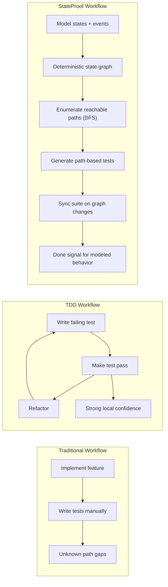
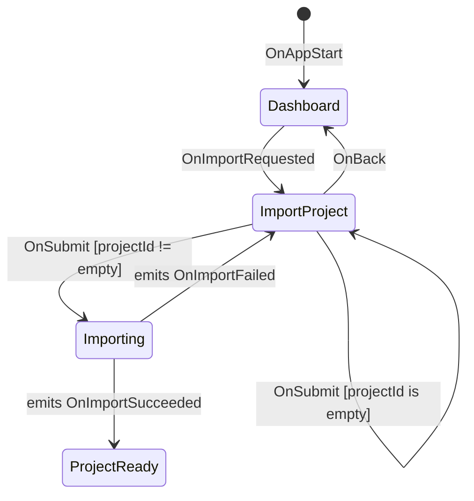
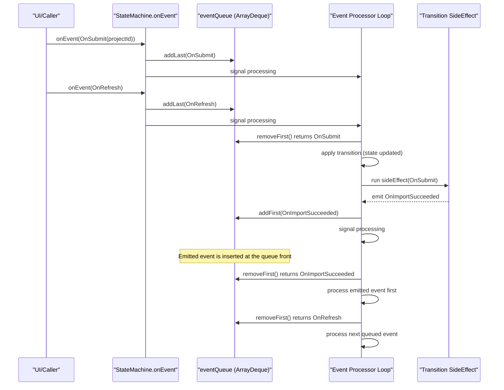
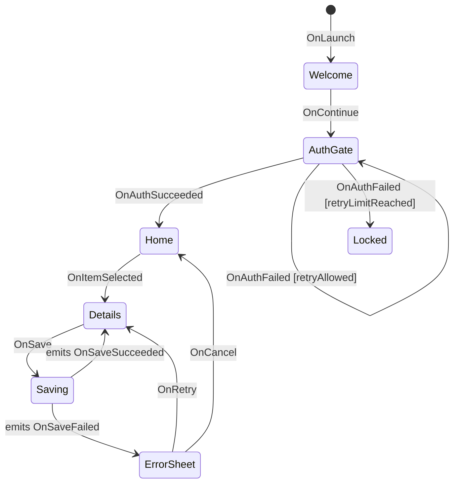
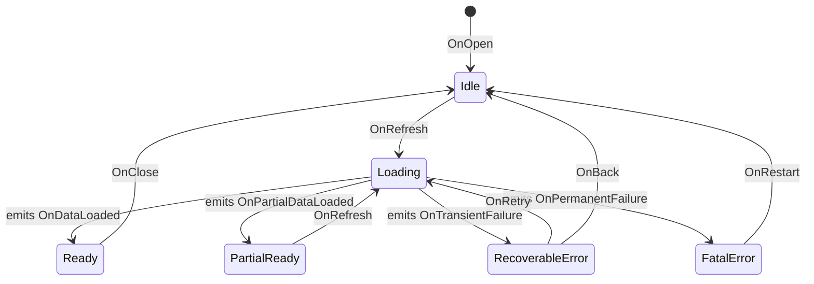

# StateProof

A Kotlin Multiplatform state machine library with exhaustive test generation.

## Core Value Proposition

**The state graph drives your behavioral test suite.** StateProof's DFS traversal algorithm enumerates reachable paths in your modeled state machine, and each path becomes a generated test case.

This reframes the testing workflow:
- **Traditional**: implement first -> manually backfill tests -> path coverage remains uncertain
- **TDD**: red/green/refactor gives strong local correctness for chosen examples
- **StateProof**: model states/events -> enumerate graph paths -> sync generated suite as the model evolves

StateProof does not replace unit, integration, visual, or runtime testing; it provides near-exhaustive coverage for **modeled UI behavior**.

## Visual Overview

### Workflow Comparison



| Approach | Goal unit | Feedback loop | Done signal | Typical blind spot |
|----------|-----------|---------------|-------------|--------------------|
| Traditional | Feature code | Manual tests added after implementation | Team judgment + exploratory confidence | Missed path combinations |
| TDD | Example-level behavior | Red -> Green -> Refactor | Chosen examples pass | State-space/path completeness is still manual |
| StateProof | Modeled state graph | Model update -> regenerate/sync suite | Reachable modeled paths are covered and green | Unmodeled concerns (visual/runtime/integration) |

### Every Screen as a State



### Quick Start for This Flow (StateProof DSL)

```kotlin
sealed class AppState {
    object Dashboard : AppState()
    object ImportProject : AppState()
    object Importing : AppState()
    object ProjectReady : AppState()
}

sealed class AppEvent {
    object OnAppStart : AppEvent()
    object OnImportRequested : AppEvent()
    object OnBack : AppEvent()
    data class OnSubmit(val projectId: String) : AppEvent() // data class event
    object OnImportSucceeded : AppEvent()
    data class OnImportFailed(val reason: String) : AppEvent() // data class event
}

val machine = stateMachine<AppState, AppEvent>(AppState.Dashboard) {
    state<AppState.Dashboard> {
        on<AppEvent.OnImportRequested> { transitionTo(AppState.ImportProject) }
    }

    state<AppState.ImportProject> {
        on<AppEvent.OnBack> { transitionTo(AppState.Dashboard) }
        on<AppEvent.OnSubmit> {
            condition("projectId != empty") { _, event -> event.projectId.isNotBlank() } then {
                transitionTo(AppState.Importing)
                sideEffect { event ->
                    if (event.projectId.endsWith(".json")) {
                        AppEvent.OnImportSucceeded
                    } else {
                        AppEvent.OnImportFailed("invalid file extension")
                    }
                } emits (
                    "import_succeeded" to AppEvent.OnImportSucceeded::class,
                    "import_failed" to AppEvent.OnImportFailed::class,
                )
            }
            otherwise { doNotTransition() } // matches self-transition case for empty projectId
        }
    }

    state<AppState.Importing> {
        on<AppEvent.OnImportSucceeded> { transitionTo(AppState.ProjectReady) }
        on<AppEvent.OnImportFailed> { transitionTo(AppState.ImportProject) }
    }
}
```

### How Event Processing Works (Queue + Side-Effect Priority)



- Transition is applied before side-effect execution.
- Side-effect emitted event is pushed to queue front.
- This priority applies within modeled runtime behavior and does not replace integration/visual tests.

### Real-World Style Examples (Anonymized)

Feature journey with guarded transitions and side-effect emitted events:



Recovery/error branching flow:



Patterns in these examples are derived from production-style apps with anonymized names.

Canonical Mermaid sources:
- `docs/diagrams/value-proposition.mmd`
- `docs/diagrams/screens-as-states.mmd`
- `docs/diagrams/runtime-event-processing.mmd`
- `docs/diagrams/demo-journey-anonymized.mmd`
- `docs/diagrams/demo-recovery-anonymized.mmd`

### Why This Works

- deterministic state graph instead of implicit UI flow
- exhaustive traversal of reachable modeled paths instead of ad-hoc test selection
- sync-safe test maintenance as transitions and guards evolve
- clear behavioral contract that complements TDD and manual exploratory testing
- AI-first onboarding with scan -> classify -> apply -> verify

## AI Agent Quickstart (3-Step)

1. Copy a skill into your agent:
   - Codex: `docs/ai/skills/codex/SKILL.md`
   - Claude: `docs/ai/skills/claude/SKILL.md`
2. Ask the agent to run setup in the current project:

   ```text
   Use the StateProof skill and run /stateproof setup for this project.
   Detect Gradle DSL first (build.gradle.kts vs build.gradle).
   Apply the correct plugin/dependency syntax without web search by using local StateProof docs.
   Then verify setup by running scan + sync + diagram + viewer tasks.
   ```

3. Run setup verification:

   ```bash
   ./gradlew :app:stateproofScan
   ./gradlew :app:stateproofSyncAll
   ./gradlew :app:stateproofDiagrams
   ./gradlew :app:stateproofViewer
   ```

If your module name is not `app`, replace `:app:` with your module path.

Full workflows, setup command contract, and playbooks: `docs/ai/README.md`.

## Definition of Done (Modeled Behavior)

Treat the generated suite as a done contract for modeled behavior when all checks below are true:

1. state/event model reflects the intended screen and flow behavior
2. guards and side-effect emitted events are explicitly represented
3. generated test set is synced and green
4. unresolved or unknown branches are reviewed and handled intentionally

This defines done for **modeled behavior** only, not full system quality.

## AI Agent Value (Constrained)

StateProof gives AI agents a concrete acceptance target: state graph + generated tests.

- if the model is correct, this yields near-exhaustive behavioral coverage for modeled paths
- with screen-as-state navigation modeling, the graph becomes a reviewable behavioral source of truth
- generated diagrams make behavior review easier than raw code-only diffs
- model quality is still the limiting factor; incomplete models can create false confidence

## Installation (Manual)

If you prefer manual setup without an AI agent, use the installation and Gradle setup sections below.

Kotlin DSL (`build.gradle.kts`):

```kotlin
plugins {
    id("io.stateproof") version "0.1.0-SNAPSHOT"
    id("com.google.devtools.ksp") // for auto-discovery
}

dependencies {
    implementation("io.stateproof:stateproof-core:0.1.0")
    implementation("io.stateproof:stateproof-annotations-jvm:0.1.0-SNAPSHOT")
    ksp("io.stateproof:stateproof-ksp:0.1.0-SNAPSHOT")
    testImplementation("io.stateproof:stateproof-viewer-jvm:0.1.0-SNAPSHOT")
}
```

Groovy DSL (`build.gradle`):

```groovy
plugins {
    id 'io.stateproof' version '0.1.0-SNAPSHOT'
    id 'com.google.devtools.ksp' // for auto-discovery
}

dependencies {
    implementation 'io.stateproof:stateproof-core:0.1.0'
    implementation 'io.stateproof:stateproof-annotations-jvm:0.1.0-SNAPSHOT'
    ksp 'io.stateproof:stateproof-ksp:0.1.0-SNAPSHOT'
    testImplementation 'io.stateproof:stateproof-viewer-jvm:0.1.0-SNAPSHOT'
}
```

Then configure `stateproof { ... }` in your module (examples in **Gradle Plugin** section).

## Quick Start

```kotlin
// Define your states
sealed class States {
    object Initial : States()
    object Loading : States()
    object Ready : States()
    object Error : States()
}

// Define your events
sealed class Events {
    object OnStart : Events()
    object OnSuccess : Events()
    object OnFailure : Events()
    object OnRetry : Events()
}

// Create a state machine
val stateMachine = stateMachine<States, Events>(States.Initial) {
    state<States.Initial> {
        on<Events.OnStart> { transitionTo(States.Loading) }
    }
    state<States.Loading> {
        on<Events.OnSuccess> { transitionTo(States.Ready) }
        on<Events.OnFailure> { transitionTo(States.Error) }
    }
    state<States.Error> {
        on<Events.OnRetry> { transitionTo(States.Loading) }
    }
}

// Generate exhaustive test cases
val testCases = stateMachine.enumerateAllPaths()
```

## JVM StateGraph Introspection

StateProof now provides a JVM-first rich graph model for introspection:

```kotlin
import io.stateproof.graph.toStateGraph

val graph = stateMachine.toStateGraph()
```

`StateGraph` contains:
- `states`: stable state nodes (`id`, `displayName`, `qualifiedName`, `groupId`, `isInitial`)
- `groups`: hierarchy groups inferred from sealed ancestry
- `transitions`: edge metadata (`guardLabel`, `emittedEvents`, and unresolved-target markers)

### Grouping Behavior

- If states are organized through nested sealed hierarchy, groups are auto-detected from that hierarchy.
- For flat state machines (no nested sealed path), all states are assigned to synthetic `General` (`group:General`).

### JVM Scope

`toStateGraph()` is currently JVM-first and intended for Android/JVM analysis workflows.
Existing `toStateInfo()` and sync/test generation APIs remain backward compatible.

## Static Diagrams (PlantUML + Mermaid/ELK)

Generate deterministic overview and per-group diagrams directly from `StateGraph`.

```kotlin
import io.stateproof.diagram.renderDiagrams
import io.stateproof.diagram.writeTo
import io.stateproof.graph.toStateGraph

val bundle = stateMachine.toStateGraph().renderDiagrams(machineName = "Main")
bundle.writeTo(File("build/stateproof/diagrams"))
```

Output layout:

```text
build/stateproof/diagrams/<machine>/
  overview.puml
  overview.mmd
  groups/
    <groupSlug>.puml
    <groupSlug>.mmd
```

Defaults:
- Mermaid output uses `flowchart LR` with ELK renderer directive.
- Edge labels include event + guard + emitted-event metadata.
- Overview shows aggregated inter-group edges (`count + sampled labels`).
- Per-group diagrams render cross-group transitions through `External::<...>` placeholders.

CLI:

```bash
# Single machine
stateproof diagrams \
  --provider com.example.MainStateMachineKt#createMainStateMachineForIntrospection \
  --is-factory \
  --output-dir build/stateproof/diagrams \
  --name main \
  --format both

# Auto-discovery (KSP registries)
stateproof diagrams-all \
  --output-dir build/stateproof/diagrams \
  --format both
```

## Interactive Viewer (MVP)

Generate a self-contained interactive HTML viewer per machine from `StateGraph`.

```kotlin
import io.stateproof.graph.toStateGraph
import io.stateproof.viewer.renderViewer
import io.stateproof.viewer.writeTo

val bundle = stateMachine.toStateGraph().renderViewer(machineName = "Main")
bundle.writeTo(File("build/stateproof/viewer"))
```

Output layout:

```text
build/stateproof/viewer/<machine>/
  index.html
  graph.json
```

Defaults:
- Cytoscape.js is bundled offline (no CDN needed).
- Default layout is `breadthfirst`.
- Viewer supports overview, group drill-down, state focus, search, and toolbar controls.
- `graph.json` sidecar is emitted by default (disable via CLI/Gradle option).

CLI (from `stateproof-viewer-jvm`):

```bash
# Single machine
stateproof-viewer viewer \
  --provider com.example.MainStateMachineKt#createMainStateMachineForIntrospection \
  --is-factory \
  --output-dir build/stateproof/viewer \
  --name main

# Auto-discovery (KSP registries)
stateproof-viewer viewer-all \
  --output-dir build/stateproof/viewer
```

## AI Agent Workflows (Detailed)

StateProof ships an AI-first integration kit so agents can onboard a project with a scan-first workflow.

Start here:

- AI docs index: `docs/ai/README.md`
- Codex skill: `docs/ai/skills/codex/SKILL.md`
- Claude skill: `docs/ai/skills/claude/SKILL.md`
- Migration playbooks: `docs/playbooks/`

### Install skill pack

Copy the skill file into your agent skill directory and invoke it in your prompt.

- Codex: use `docs/ai/skills/codex/SKILL.md`
- Claude: use `docs/ai/skills/claude/SKILL.md`

### Setup current project with AI

- Use command: `/stateproof setup`
- This setup flow should:
  - detect Gradle DSL (`build.gradle.kts` vs `build.gradle`)
  - apply plugin + dependency + config syntax for that DSL
  - use local StateProof docs (no internet search needed)
  - verify with `stateproofScan`, `stateproofSyncAll`, `stateproofDiagrams`, and `stateproofViewer`

### Existing Android/KMP migration (screens-as-states)

- Use playbook: `docs/playbooks/migration-existing-android-kmp.md`
- Run scan first:

```bash
./gradlew :app:stateproofScan
```

- Then run the generation workflow:

```bash
./gradlew :app:stateproofSyncAll
./gradlew :app:stateproofDiagrams
./gradlew :app:stateproofViewer
```

### Non-KMP fallback (state machine-only)

When your target project is JVM/non-KMP or not using screen-navigation mapping yet, use state-machine-only flow:

- Playbook: `docs/playbooks/non-kmp-state-machine-only.md`
- Sample: `samples/non-kmp-jvm/`

### `/stateproof` command reference (agent contract)

These command names are documented workflow aliases for AI agents:

- `/stateproof setup` -> setup plugin + dependencies + config for current project/module (Kotlin/Groovy DSL aware)
- `/stateproof scan` -> `stateproofScan`
- `/stateproof tests` -> `stateproofSyncAll`
- `/stateproof diagram` -> `stateproofDiagrams`
- `/stateproof viewer` -> `stateproofViewer`
- `/stateproof watch` -> `stateproofWatch`
- `/stateproof migrate-screens` -> migration playbook
- `/stateproof add-screen` -> add-screen playbook

### Scan + watch tasks

```bash
# Generate deterministic project profile JSON
./gradlew :app:stateproofScan

# Start watch loop (mode via stateproof.watchMode = tests|diagram|viewer|all)
./gradlew :app:stateproofWatch
```

## Gradle Plugin

StateProof uses **sync-only** to safely manage your test files.

### Important: Sync-Only Design

- ✅ **Adds** new tests for new state machine paths
- ✅ **Updates** expected transitions when paths change
- ✅ **Marks** obsolete tests with `@StateProofObsolete`
- ✅ **Preserves** all user-written test implementations
- ❌ **Never deletes** any test code automatically

**Test naming format**: `_depth_CRC_from_startState_to_endState`

Example: `_4_1698_from_Initial_to_Settings`

**To regenerate a test**: Delete it manually, then run sync again.

### Setup

```kotlin
// settings.gradle.kts
pluginManagement {
    repositories {
        mavenLocal()
        gradlePluginPortal()
    }
}

// build.gradle.kts
plugins {
    id("io.stateproof") version "0.1.0-SNAPSHOT"
}

stateproof {
    stateMachines {
        create("main") {
            infoProvider.set("com.example.MainStateMachineKt#getMainStateMachineInfo")
            initialState.set("Initial")
        }
    }
}
```

If you use viewer tasks, add the viewer artifact to your test/runtime classpath:

```kotlin
dependencies {
    testImplementation("io.stateproof:stateproof-viewer-jvm:0.1.0-SNAPSHOT")
}
```

### Available Tasks

| Task | Description |
|------|-------------|
| `stateproofSyncAll` | Sync tests for all state machines |
| `stateproofSync<Name>` | Sync tests for a specific state machine |
| `stateproofSyncDryRun<Name>` | Preview sync changes without writing |
| `stateproofStatus<Name>` | Show current sync status |
| `stateproofCleanObsolete<Name>` | List obsolete tests |
| `stateproofDiagrams` | Generate static diagrams (single mode or alias to all) |
| `stateproofDiagrams<Name>` | Generate static diagrams for a specific state machine (multi mode) |
| `stateproofDiagramsAll` | Generate static diagrams for all state machines |
| `stateproofViewer` | Generate interactive viewer (single mode or alias to all) |
| `stateproofViewer<Name>` | Generate interactive viewer for a specific state machine (multi mode) |
| `stateproofViewerAll` | Generate interactive viewers for all state machines |
| `stateproofScan` | Generate project profile JSON for AI-assisted integration |
| `stateproofWatch` | Watch configured paths and trigger sync/diagram/viewer actions |

### Test Dependencies

Add these dependencies for generated tests:

```kotlin
// JVM / Android Unit Tests
testImplementation("org.jetbrains.kotlin:kotlin-test:1.9.21")
testImplementation("org.jetbrains.kotlinx:kotlinx-coroutines-test:1.7.3")

// Android Instrumented Tests (if using android target)
androidTestImplementation("org.jetbrains.kotlin:kotlin-test:1.9.21")
androidTestImplementation("org.jetbrains.kotlinx:kotlinx-coroutines-test:1.7.3")
```

## Roadmap (Planned)

These items are planned next and intentionally not treated as current guarantees:

- IDE plugins for IntelliJ IDEA and Android Studio guidance/automation
- screenshot test generation integration for visual regression confidence and story-like flow playback
- edge-case test generation integration for broader failure-path coverage

## Modules

- `stateproof-core` - Core KMP state machine library
- `stateproof-compose` - Compose Multiplatform integration (coming soon)
- `stateproof-navigation` - Jetpack Navigation integration (coming soon)
- `stateproof-gradle-plugin` - Gradle plugin for test, diagram, and viewer generation
- `stateproof-viewer` - Interactive state graph viewer generator (JVM-first)

## License

Apache 2.0
